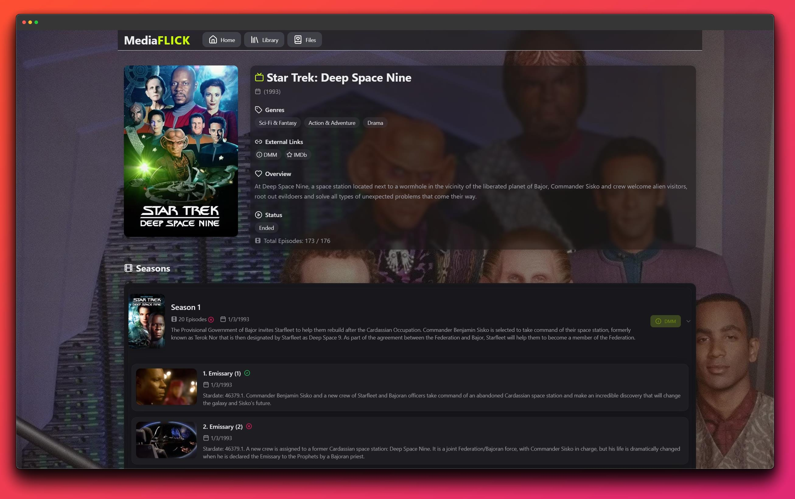

# MediaFlick

## Description

MediaFlick is a media management tool that allows you to scan your media library and automatically organize your files into folders based on their metadata. It uses the TMDb API to get information about movies and TV shows, and it can also detect and rename files based on their metadata.
